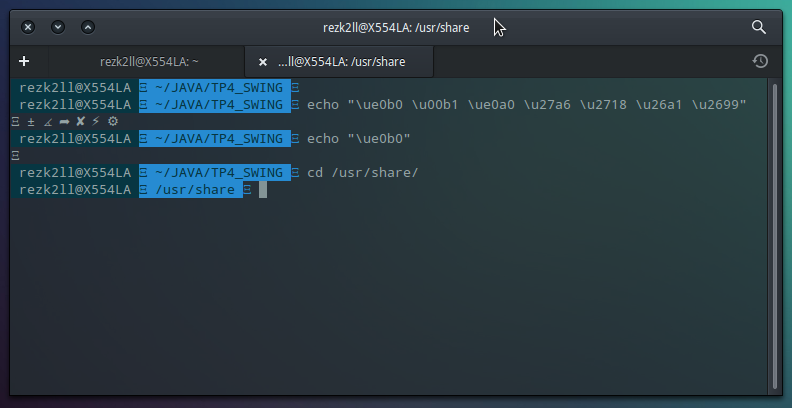

Agree or not, making your IDE beautiful and readable is important. I use PyCharm and CLion a crazy lot. These are my theme preferences:

Theme: One Dark Theme (I guess it's inspired by Atom. Before I used to use sublime, but God Atom is so good). Specially One Dark Vivid Italica  
Coding Font: Fira Code (Style: Retina) with ligatures enabled
Font Size: 16  

Also the terminal and it's theme is very important. Recently I started using zsh. It's very good and I like it. The main problem you will face is that after installing zsh, when you start using it gnome-terminal, many of the symbols which the theme alabaster uses won't render correctly. It will show something like this below:

Well the problem in my case was that the Ligconsolata font in my terminal I was using, didn't had these symbols. Fortunately Fira Code (Exact same font as mentioned above) has already all these symbols so just change to that and you will be fine.

Enjoy Coding Folks!
