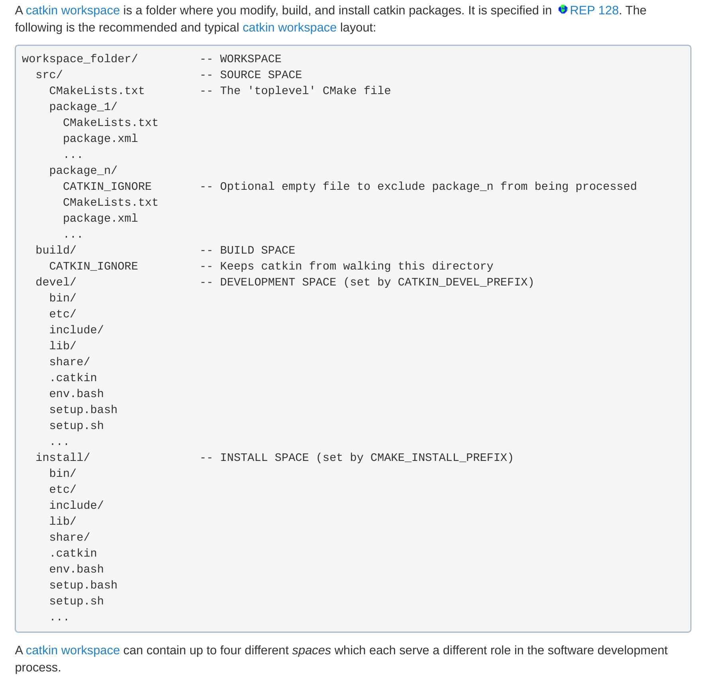

So I had to work on Gazebo for my independent study. At that time I shared the same feeling as Lana Del Rey: God save our young blood!. Anyways here I am writing this. Let's get into this.

Catkin workspace in the backend totally rely on CMakelists.txt. The structure of a catkin workspace looks something like this:



Reference: http://wiki.ros.org/catkin/workspaces

Before starting anything what many people don't tell you is that you need to activate ros setup before building libfranka.

```bash
source /opt/ros/melodic/setup.bash
```

So in the src folder you have all your required packages. In the devel you will have all binaries generated after catkin_make command, and install is the folder where everything gets install. The catkin_make will not install in /usr/bin folder as uninstalling everything would be nearly impossible and nobody will keep track of where all the files went. 

So now let's dive into how each package is made. I will use package and ROS package interchangeably but they both mean the same. Each package has to contain these two files for sure: CMakelists.txt and package.xml. CMakelists.txt is for building and package.xml is for know dependency whereabouts. If they aren't there catkin make won't compile. There is an easy way to generate a ROS package. Below is the command:

```bash
catkin_create_pkg beginner_tutorials std_msgs rospy roscpp
```

catkin_create_pkg is a command, beginner_tutorials is the package name, std_msgs rospy roscpp are the dependencies required for the ROS package to run. If you are making python scripts then **rospy** is needed.

Now lets take up a simple project. We will try to run gazebo simulation of Franka Emika robot. It's basically a robotic arm, that can be controlled. It's very agile. We will be using 4 repositories. 3 are open source, one is closed source for mumbo-jumbo reasons that I love to get into, but not in this blog. Anyways, the people who read this blog is only me so couldn't care less.

```bash
sudo apt-get install libboost-filesystem-dev
```

At the time of writing, melodic was the latest, with direct install support in Ubuntu 18.04 LTS.

First let's make directory where we will put all our ROS packages. Go to your favorite place in your Ubuntu PC and then execute the commands below:

```bash
mkdir robot_skin_gazebo
cd robot_skin_gazebo
mkdir src
mkdir devel
mkdir install
```

Now this your catkin work space. Now change directory into src for cloning all the Git repositories mentioned below.

The 4 repositories are:

panda_simulation: https://github.com/erdalpekel/panda_simulation

franka_ros: https://github.com/frankaemika/franka_ros

panda_moveit_config: https://github.com/ros-planning/panda_moveit_config

libfranka: git@github.com:frankaemika/libfranka.git

ros_robotic_skin: https://github.com/HIRO-group/ros_robotic_skin (Unfortunately closed source)

For easy SSH download authentications, below are the commands:

```bash
git clone https://github.com/erdalpekel/panda_simulation.git
git clone --branch simulation https://github.com/erdalpekel/franka_ros.git
git clone https://github.com/ros-planning/panda_moveit_config.git
git clone --recursive https://github.com/frankaemika/libfranka
git clone git@github.com:HIRO-group/ros_robotic_skin.git
```

Now you need to make a build folder for libfranka

```bash
cd libfranka
mkdir build
cd ..
```


Now you need to check whether you have all the dependencies required or not. To check that you need to execute:

```bash
cd ..
rosdep install --from-paths src --ignore-src -y --skip-keys libfranka
```

Now it's time to activate the ROS commands, by using:

```bash
catkin_make
```

This will generate a top level CMakelists.txt in src for you.

To install libfranka by source follow below commands:

```bash
cd src
git clone --recursive https://github.com/frankaemika/libfranka
cd libfranka
mkdir build
cd build
cmake -DCMAKE_BUILD_TYPE=Release ..
make
```


Now cd into robot_skin_gazebo main directory and run catkin_make again. You need to put the libfranka build path, not the build path i have shown here. This is just an example.

```bash
catkin_make -j4 -DCMAKE_BUILD_TYPE=Release -DFranka_DIR:PATH=~/PycharmProjects/robot_skin_gazebo/src/libfranka/build
```

This should compile all your packages you just git cloned. 


Or to build everything you can run everything from my other Repo:

```bash
git clone https://github.com/HIRO-group/ROS_launch_scripts
```

build_all_packages.bash

Finally run the command:

```bash
roslaunch ros_robotic_skin simulation.launch
```

And you have your simulation.