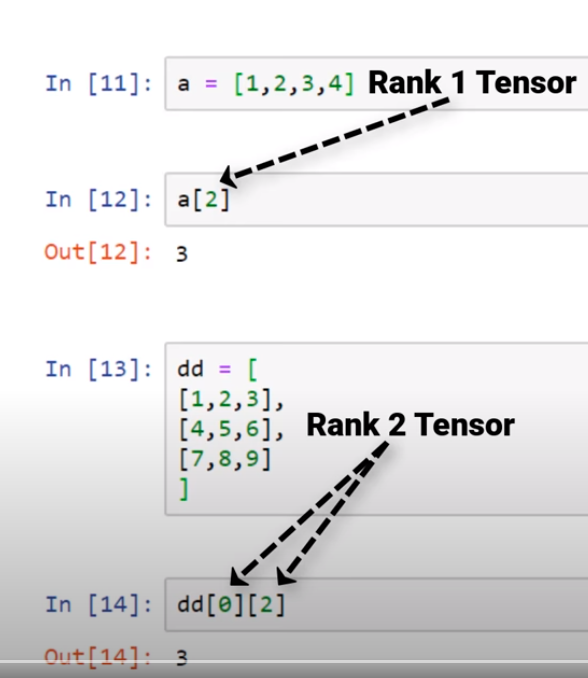

Giving the credits to where it is due: [Youtube deeplizard Pytorch](https://www.youtube.com/watch?v=AiyK0idr4uM&list=PLZbbT5o_s2xrfNyHZsM6ufI0iZENK9xgG&index=6)

In this blog post I am writing to understand more about the tensors. Lemme put the matehematics terminology and CS terminology side by side to make it more understanadable.

| Maths Terminology 	| CS Terminology 	|
|:-----------------:	|:--------------:	|
|       Scalar      	|     Number     	|
|       array       	|     vector     	|
|      2d-array     	|     matrix     	|
|     nd-tensor     	|    nd-array    	|

This is how tensors originated.

Rank of a Tensor:
This referes to number of dimensions present within the tensor. For example a 2d-array or 2d-tensor will have a rank of 2. 3d-array will have a rank of 3. The rank of the tensor will give an idea of how many indices need to be used to access a specific element in the tensor. Anything less the rank will output an nd-array. Below figure illustartes what I am trying to say:

Shape of Tensor:
The shape of a tensor given information about how many indices are present on each axes. For example a 2d-array can have a shape of 3x3 etc. Means there are 3 rows and 3 columns. This can be generalized to n-dimensions. 

Lets jump to image input. The image input is an rank-4 tensor A = ($A_0$, $A_1$, $A_2$, $A_3$). $A_0$ is the batch size or in layman terms the number of images this tensor has. $A_1$, $A_2$, $A_3$ respectively can be either height, width, channels OR channels, height, width. My preference is height, width, channels and it's standard followed by many other libraries like ImageIO.

Understanding these tensors can be difficult at first. This is how I understood them. In any tensor the first indice can be corresponded to a row in a matrix and the second indice can be corresponded to a column. Now there will be many multiple indices in an nd-array. How to get past that? So here is another trick. First you need to find what is the minimum scalar or array you want? For example given a 3-D array and it's an array of scalars. If you want a scalar you need to index in 3 levels to get a scalar. For e.g. 3d_array in 3d-array. 3d_array[i][j][k] will give you a scalar. Now for example you have been given a tensor of images similar to above paragraph. And you want images. image is a 3D array so A is given, to get a single image you will do A[i] where i can vary from 0 to first index in shape of tensor of A minus 1. This is complex way of saying "Yo, the batch size signifies the number of umages. So i can vary in between 0 to batch_size-1". Why minus one? because we start indexing from 0. Lets revise. First indice row, second indice column, rest each element in matrix is an nd-array. Now take each element, as it is an nd-array you can apply the same logic, first indice row, second indice column rinse and repeat.  

This explains the tensors! See you around!!

 